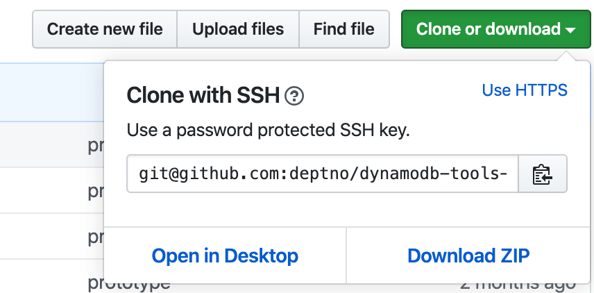
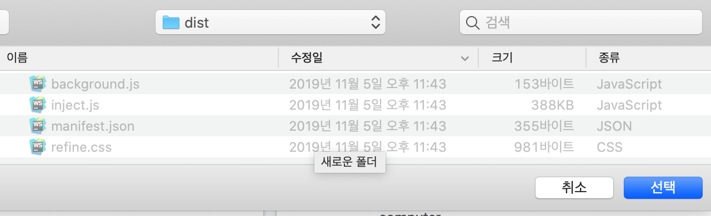
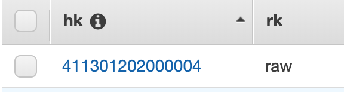
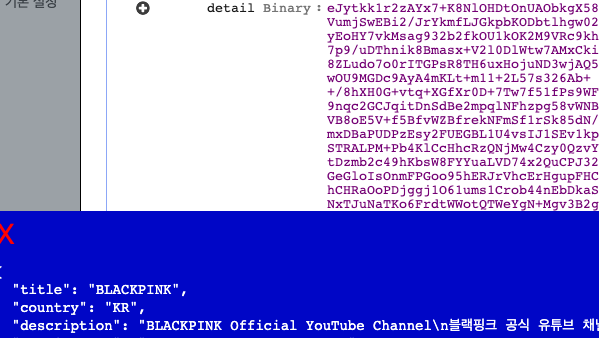

# dynamodb-tools-chrome-extension

deflated document property -> JSON

## installation

click `Download ZIP` and extract it

click `load extension`(??) button

select `dist` directory

  

click `r` button once(⚠️ there is no reaction)

open `document` in aws dynamodb console

mouse over Binary(inflated data) data

